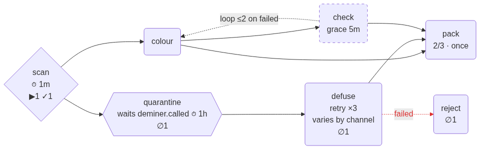

# Drawing a graph

`quazardous.grampy.diagram` turns a graph into a picture. It is optional:
`import quazardous.grampy` never loads it, and it needs nothing but the
standard library.

```python
from quazardous.grampy.diagram import overlay, to_dot, to_mermaid, to_state_diagram

print(to_mermaid(graph))                    # paste into any Markdown that renders Mermaid
print(to_mermaid(graph, overlay(journal)))  # with ⧖ waiting ▶ running ✓ done ✗ failed …
print(to_state_diagram(graph))              # the same graph as a statechart
print(to_dot(graph))                        # Graphviz
```



## Every mechanism has a shape

Nothing declared is left undrawn — the tests confront each `Node` setting with
the drawing.

| in the graph | in the flowchart | in the state diagram |
|---|---|---|
| choice | a diamond | a `<<choice>>` pseudo-state |
| wait | a hexagon, with the event and its timeout | a state with a note |
| lane | a trapezoid, with merge, cooldown and max wait | a state with a note |
| optional | a dashed border, with its grace | a note |
| `need=k` | `k/n` on the node | `need k/n` leaving the join |
| on failed | a dashed red edge, labelled | an outcome `<<choice>>` |
| loop | a dotted edge back, `loop ≤max` | a transition back |
| retry | `retry ×limit` on the node | a transition to itself |
| rate, concurrency | `rate 100/1m`, `≤4 at once`, `per channel` | a note |
| changed by a channel | `varies by channel` | a note |

Counts (`overlay(journal)`) are a second layer on the flowchart only: Mermaid
cannot style the states of a state diagram the way it styles a flowchart's
nodes.

## Which view for what

- **flowchart** — the working view: the shape of the line, and the live counts
  per node.
- **state diagram** — the statechart reading, for people coming from XState:
  `[*]` into the root and out of the leaves, forks and joins, choices for
  branches taken on different outcomes.
- **DOT** — for Graphviz, when you want a file rendered by a toolchain.
